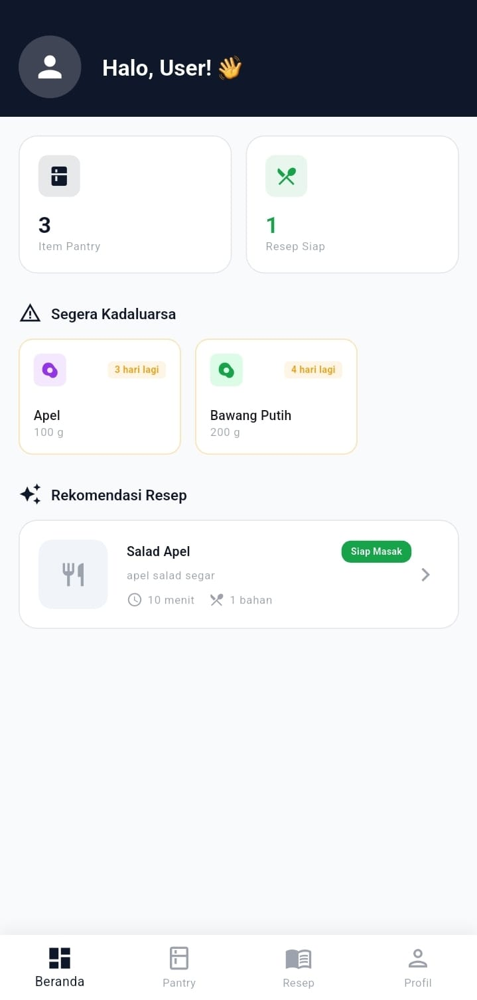
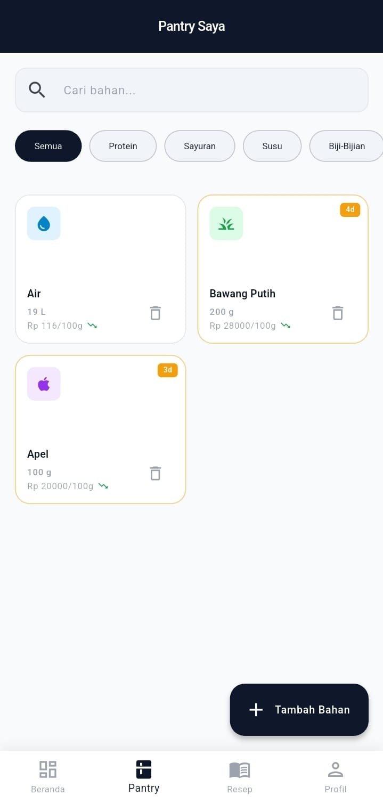
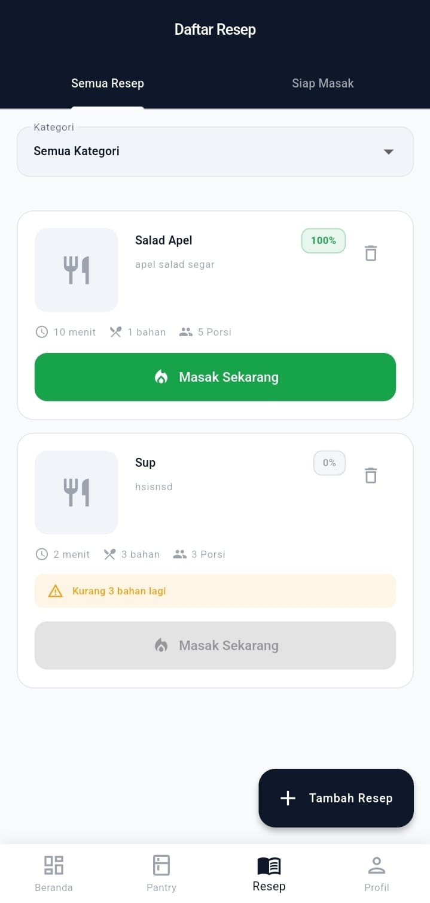

# 🍳 MyPantries - Smart Pantry & Meal Planner

<p align="center">
  
</p>

<p align="center">
  Aplikasi mobile untuk mengelola bahan makanan di rumah dan menemukan resep berdasarkan bahan yang tersedia.
</p>

---

## 📖 Tentang Proyek

**MyPantries** adalah aplikasi mobile berbasis Flutter yang membantu pengguna:

- Melacak bahan makanan yang tersedia di rumah (pantry)
- Memantau tanggal kadaluwarsa bahan makanan
- Menemukan resep berdasarkan bahan yang dimiliki
- Memasak resep dan otomatis mengurangi stok bahan dari pantry
- Membuat dan mengelola resep makanan sendiri

Aplikasi ini terhubung dengan backend API Laravel untuk menyimpan dan mengelola data.

---

## ✨ Fitur

### 🏠 Dashboard

- Statistik jumlah bahan di pantry
- Jumlah resep yang bisa dimasak
- Peringatan bahan yang akan kadaluwarsa
- Rekomendasi resep berdasarkan bahan tersedia

### 🥬 Manajemen Pantry

- Tambah, edit, hapus bahan makanan
- Tracking tanggal kadaluwarsa
- Filter berdasarkan kategori
- Pencarian bahan
- Indikator tren harga

### 🍲 Manajemen Resep

- Lihat semua resep dengan match percentage
- Filter resep yang bisa dimasak ("Siap Masak")
- Filter berdasarkan kategori
- Fitur "Masak Sekarang" yang mengurangi stok bahan
- Tambah, edit, hapus resep

### 👤 Profil Pengguna

- Login dan registrasi
- Informasi profil
- Logout

---

## 🚀 Instalasi

### 1. Clone Repository

```bash
git clone [https://github.com/Irsyadadfiansha/UAS_PAM_MyPantries_Kelas_B.git]
cd mypantries-mobile
```

### 2. Install Dependencies

```bash
flutter pub get
```

---

## ▶️ Menjalankan Aplikasi

### Mode Development

```bash
# Jalankan dengan hot reload
flutter run

# Pilih device jika ada beberapa
flutter run -d <device_id>

# Lihat daftar device
flutter devices
```

### Mode Debug dengan Chrome DevTools

```bash
flutter run --debug
```

### Mode Release (untuk testing performa)

```bash
flutter run --release
```

---

## 📁 Struktur Proyek

```
lib/
├── main.dart                   
├── app.dart                    
│
├── core/                        
│   ├── constants/
│   │   ├── api_constants.dart  
│   │   ├── app_colors.dart      
│   │   └── app_strings.dart  
│   ├── network/
│   │   ├── api_client.dart      
│   │   ├── api_exceptions.dart  
│   │   └── api_interceptor.dart 
│   ├── theme/
│   │   └── app_theme.dart     
│   └── utils/
│       ├── date_utils.dart      
│       ├── unit_converter.dart 
│       └── validators.dart      
│
├── data/                     
│   ├── models/                  
│   │   ├── user_model.dart
│   │   ├── ingredient_model.dart
│   │   ├── pantry_item_model.dart
│   │   └── recipe_model.dart
│   ├── repositories/            
│   │   ├── auth_repository.dart
│   │   ├── pantry_repository.dart
│   │   ├── recipe_repository.dart
│   │   └── ingredient_repository.dart
│   └── services/
│       └── storage_service.dart 
│
├── presentation/                
│   ├── providers/              
│   │   ├── auth_provider.dart
│   │   ├── pantry_provider.dart
│   │   ├── recipe_provider.dart
│   │   └── ingredient_provider.dart
│   ├── screens/                
│   │   ├── auth/
│   │   │   ├── login_screen.dart
│   │   │   └── register_screen.dart
│   │   ├── home/
│   │   │   └── home_screen.dart
│   │   ├── pantry/
│   │   │   └── pantry_screen.dart
│   │   ├── recipes/
│   │   │   ├── recipes_screen.dart
│   │   │   └── recipe_detail_screen.dart
│   │   └── profile/
│   │       └── profile_screen.dart
│   └── widgets/                
│       └── common/
│           ├── loading_widget.dart
│           ├── error_widget.dart
│           └── empty_state_widget.dart
│
└── routes/
    └── app_router.dart          
```

---

## 🧪 Testing

```bash
# Run unit tests
flutter test

# Run integration tests
flutter test integration_test/
```

---

## 📱 Screenshots

| Home                          | Pantry                            | Recipes                             |
| ----------------------------- | --------------------------------- | ----------------------------------- |
|  |  |  |

---

## 📄 Lisensi

Proyek ini dibuat untuk keperluan tugas kuliah.

---

## 👥 Tim Pengembang

- **[Irsyad Adfiansha Hidayat]** - 1237050042
- **[Fauzi Abdul  Malik]** -  1237050018
- **[Fauzan Ramdhani]** -  1237050045
- **[Fariz Ahmad Fadillah]** -  1237050064

---

## 📞 Kontak

Jika ada pertanyaan, silakan hubungi:

- Email: irsyadadfiansha9@gmail.com
- GitHub: [Profile_Github](https://github.com/Irsyadadfiansha)

---

Web UIN Sunan Gunung Djati Bandung : ([https://uinsgd.ac.id/](https://uinsgd.ac.id/)) 
Jurusan Informatika : ([http://if.uinsgd.ac.id/](http://if.uinsgd.ac.id/)) 

---

- pitch deck : ([pitch_deck](https://www.canva.com/design/DAG8_zhD--U/mtmeqbWrGTyLsI_Y9wkWgw/edit?utm_content=DAG8_zhD--U&utm_campaign=designshare&utm_medium=link2&utm_source=sharebutton))

---

<p align="center">
  Made with ❤️ using Flutter
</p>
